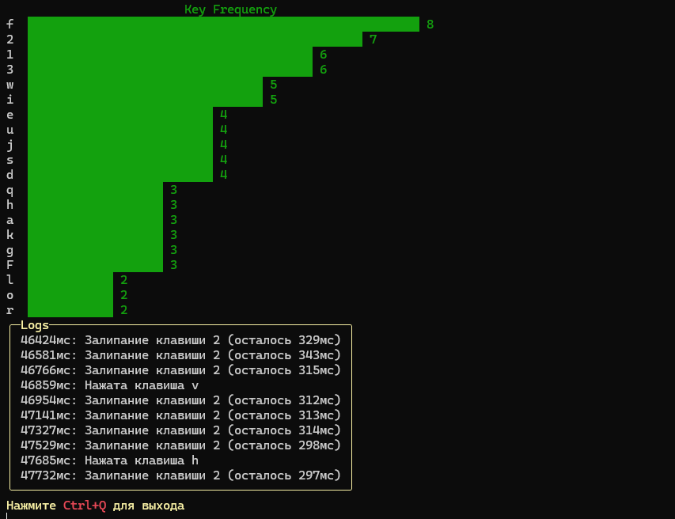
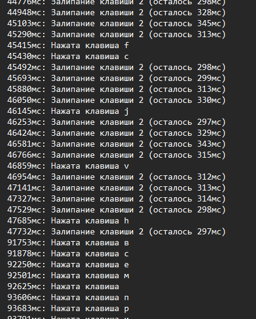

# KeyThrottleRx

**KeyThrottleRx** — это  проект на C#, где я попытался сделать что-то с помощью реактивного программирования. Здесь обрабатываются события нажатий клавиш, предотвращается залипание, а всё это отображается в виде графиков прямо в консоли. 

---

## Как это выглядит

Вот график частоты нажатий клавиш:

А вот логи, где можно увидеть, когда какая клавиша залипла:

---

## Что делает этот проект?
- Следит за нажатиями клавиш.
- Предупреждает, если клавиша начинает "залипать".
- Рисует прикольные графики в консоли.
- Записывает события в текстовый файл, чтобы потом их можно было пересмотреть.

---
